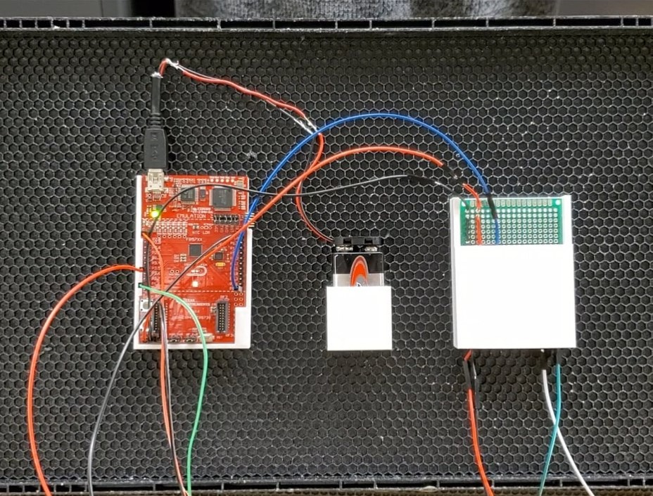
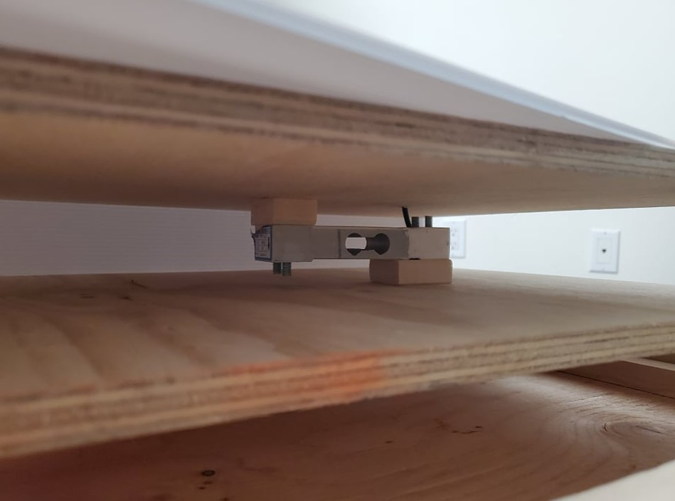
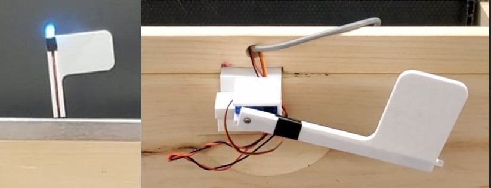
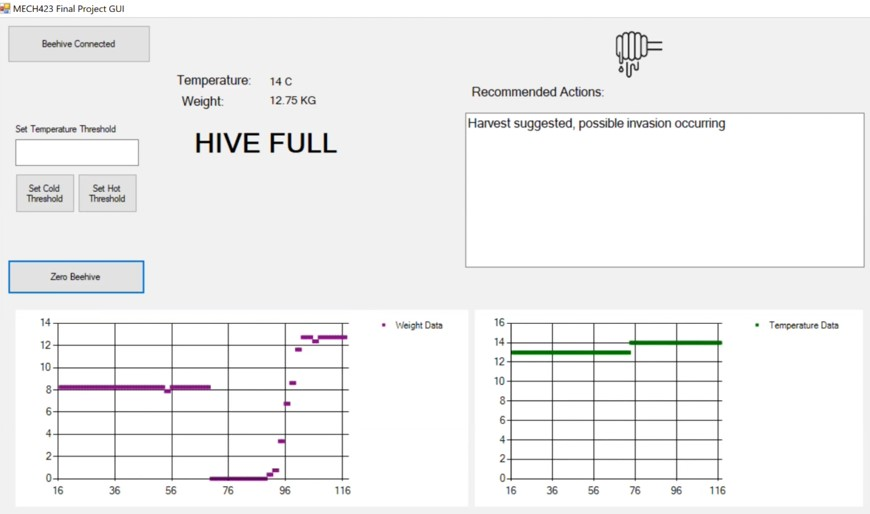



The motivation behind this ongoing project is to create a beehive which can help beekeepers and their colonies thrive. Due to the lack of technology which has penetrated this space, this first part of the
project aims to create some modules which can help beekeepers by keeping track of various metrics of their hive. A motorized flag was also made as an easy assessment based on whether
or not the hive was in a harvet-ready state. Moreover, the software aims to assist beekeepers by providing recommended actions based on the current status of the hive, which can especially be helpful for novice beekeepers. 

For this part, a standard superdeep beehive box was used as reference for the modules which we would design. The hive consisted of an accelerometer, a temperature sensor, and a load cell to capture
critical metrics for the beehive. The accelerometer and the temperature sensor were aprt of the microntroller which was used for the project, the MSP430. A amplifer module and circuit was also created
to power the load cell.

In order to house the electronics, I created CAD models which were 3D printed to hold the electronics, and I mounted them to a single frame on the inside of the beehive.

For the load cell, I used wood to create a simple platform mechanism which the beehive could rest on. From this, I create cable routings which would allow the load cell to connect to the other
electronics.

Finally, I created a servo housing which would hold the servo motor and its LED flag. This portion was meant to be a weight indicator, telling the beekeeper when thei hive was in a harvestable state.

For the coding of this project, the firmware was written for the MP430 board using C, while a Windows Form was used to create the UI. The UI would report the various temeprature and weight values back
to the user. It would also show suggested actions based on the data, track and store the data in Excel over time, and have some user functions to interact with the beehive.

From this part of the project, a team and I are undertaking the development of some other components, which focus on climate control, varroa mite detection, and feeding. These actionable items will 
aim to further improve the usability of the hive iself. 

A report was written for this first stage of the project, attached below.

<embed src="https://t-guan.github.io/Portfolio/Projects/pdfs/SmartBeehivePR.pdf" type="application/pdf" style="min-height:100vh;width:100%"/>
