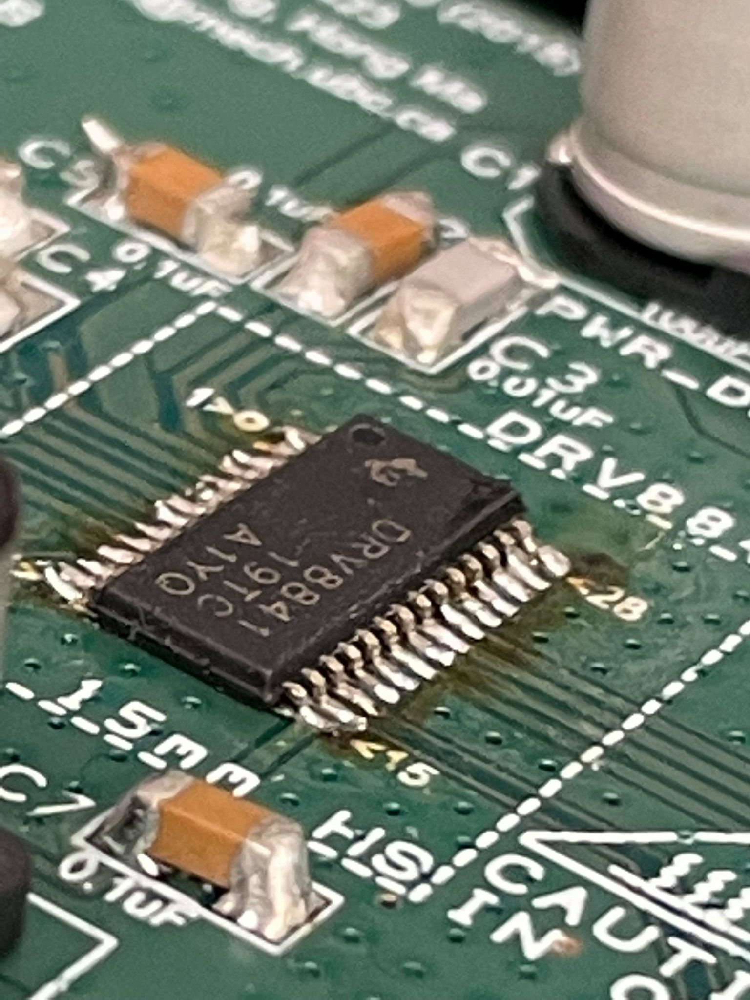
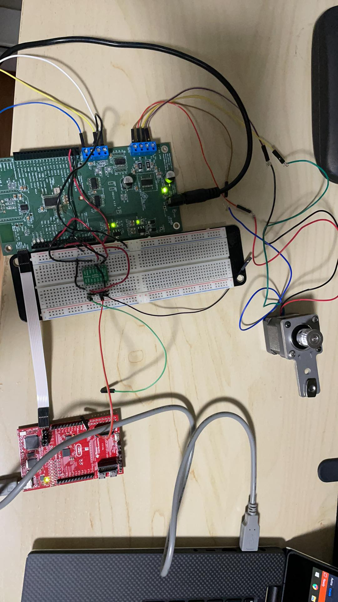
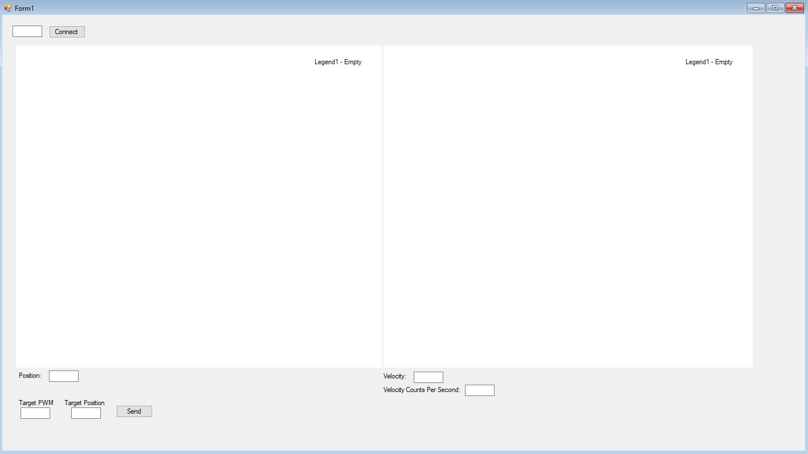

For this project, a two-axis gantry which is shown in the image was made. It was controlled by a TI MSP430 chip on a custom PCB motor controller board.
The purpose of this project was to learn how to write firmware to control these types of mechatroncis systems, and apply control theory to achieve desired behaviours.

In order to program the controller chip on the PCB, a bridge was used to transfer the data through a TI MSP430 protoboard, which was connected via USB to a PC, seen below.

A proportional controller was created to move the bottom platform to a desired location, which was developed by using a Windows Form Application in C#. This Windows Form application could plot velocity and position, and also
accept target PWM, modifying speed, and position values.

The proportional contoller was designed such that the position would not be overshot by more than 5mm which was refied through testing and tuning.

The largest issues which had to be resolved was the actual tuning of the controller, having to account for the gearbox and encoder resolution to ensure the speciications could be met. Moreover, another issue which was difficult to 
resolve was the transfer of data between the chip on the motor driver PCB and the computer itself. There were issues due to the UART method of communication and the packets being sent in either 
direction. This sometimes caused some lags or even missed data. This issue was eventually resolved by creating different timings for data packets being sent and recived, and create robust packet creation and
checking systems on both the Windows PC and the contoller PCB.
