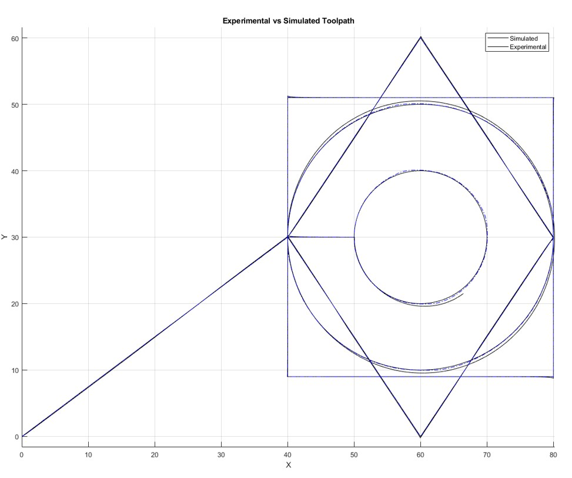

This project was mostly an excerise in applying the control theory learned in courses to practical applications. The 2D CNC machine shown in the image above was provided to use through the UBC Manufacturing and Controls laboratory. For the first portion of the project, MATLAB SIMULINK was used to create various controllers, such as PID, 
Lead-Lag, and Pole Placement controllers. Various aspects of the simulation were observed, while also designing to reach a desrived overshoot and response from the machine.
The characteristic equations outlining the machine were based on a ball-screw drive table. However, due to the nature of many assumptions made for simplification, there would always be some error in the trajectories as well as our simulations. These behaviours were simulated along with the controls which were used. Ultimately, the controller
used on the machine was a lead-lag controller with specified characteristics.

Afterwards, a trajectory was generated which was written into a .mat file to be used on the machine itself. The simulated and actual trajectory were compaored to see how each different controller could affect the response of the machine itself.
These excersies were a great start to learning how our classroom theory could be used in practice, and inspired me to continue learning Modern control engineering.

