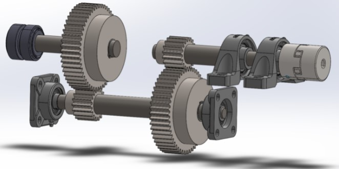

As part of my time on the UBC Sustaingineering design team, I worked on the Mechanical Team on the wind turbine project. For this project, we partnered with an NGO, Casa Congo, to build a small wind turbine to power a school based in Nicaruagua.

One of the biggest priorities for our stakeholder was that the wind turbine be created out of recycled or repurposed materials easily accessible to the community around the school. Together, we aimed to prove how accessible clean energy could be to a variety of people, 

As part of this project, I lead the Mechanical team to develop one of our first prototypes, which was built using spare wood and some bike parts. We continued to work with our partner and learned that bamboo was a building material which was easily found and accessed by the community. 
Here, we pivoted our focus to build as much of the turbine as we could using bamboo. We started using 3D CAD to develop and design various different kinds of turbines. We analyzed various styles of wind turbine, which includes stationary turbines, and horizontal and vertical axis wind turbines. I worked closely along my team while also ensuring 
robust communication between ourselves and our stakeholders. I delegated tasks, and held design reviews and check-ins with my team.

Together, we worked through the COVID-19 pandemic, switching gears to work as much as we could in simulations with FEA software, CAD, and flow simulations. Moreover, I and a group of others created a gearbox to meet the needs of the power generation of the project based on wind data which was collected and recorded by our partner organization. The underlying
mathematics of the gear drive design can be found in the PDF at the bottom of the page.

Unfortunately, due to the pandemic circumstances, building on the turbine was halted, and due to the new variant, that progress continues to be stalled. However, we are working closely with University Labs and regulations to ensure progress is still being made, despite these challenges.

<embed src="https://t-guan.github.io/Portfolio/Projects/pdfs/TurbDrive.pdf" type="application/pdf" style="min-height:100vh;width:100%"/>